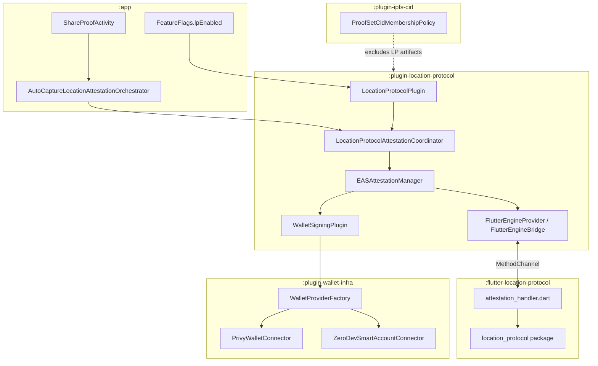
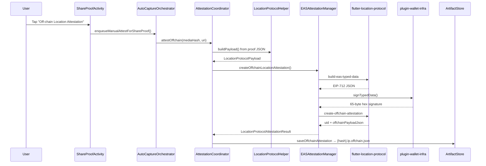
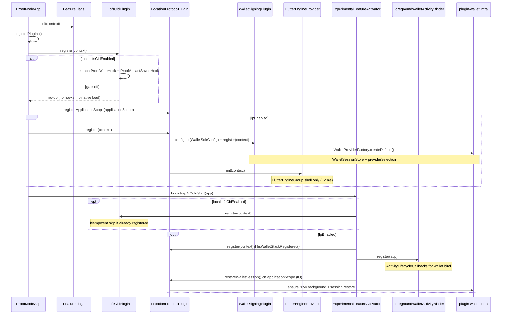
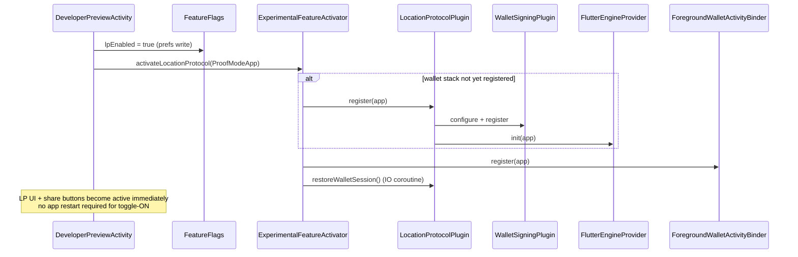

# Location Protocol Integration — Developer Onboarding Guide

**Audience:** Proofmode team members new to the Location Protocol (LP) work  
**Modules covered:** `flutter-location-protocol`, `plugin-location-protocol`, `plugin-wallet-infra`, `plugin-ipfs-cid`

---

## What problem it solves

Proofmode already stores GPS, timestamps, and file hashes in a proof set. Location Protocol wraps that into an **Ethereum Attestation Service (EAS)** attestation — a cryptographically signed claim about _where_ and _when_ media was captured, anchored to the proof's media hash.

Two legs exist:

| Leg           | What happens                                                                         | Artifact saved                                              |
| ------------- | ------------------------------------------------------------------------------------ | ----------------------------------------------------------- |
| **Off-chain** | Build EIP-712 typed data → Privy signs → Dart assembles signed off-chain attestation | `{hash}.lp.offchain.json`                                   |
| **On-chain**  | Build EAS `attest()` calldata → wallet submits tx → poll receipt for UID             | `{hash}.lp.onchain.pending.json` → `{hash}.lp.onchain.json` |

---

## Module map and dependency graph



**Dependency rules (important):**

- `:app` → `:plugin-location-protocol` (and separately `:plugin-ipfs-cid`)
- `:plugin-location-protocol` → `:plugin-wallet-infra` + `:flutter` (the embedded Flutter module)
- `:plugin-ipfs-cid` does **not** depend on LP — it mirrors LP artifact suffixes locally to avoid a cross-plugin dependency
- `:app` never talks to Flutter or wallet-infra directly for LP; it goes through `LocationProtocolPlugin`

Plugin wiring (cold start, hot toggle, and how to add a new plugin) is documented in [Plugin registration](#plugin-registration).

---

## Core design principles

### 1. LP is share-flow / user-triggered, not ingestion-time

`MediaWatcher` and `NotarizationProvider` are unchanged. LP does not run when a photo is captured. It runs when the user taps **Off-chain** or **On-chain Location Attestation** in `ShareProofActivity`, or via the auto-capture orchestrator after proof generation.

This is an intentional boundary: attestation requires wallet auth and user intent.

### 2. Kotlin orchestrates; Dart computes crypto

The split is strict:

| Layer                                   | Responsibility                                                                   |
| --------------------------------------- | -------------------------------------------------------------------------------- |
| **Kotlin** (`plugin-location-protocol`) | Payload from proof data, wallet signing, tx submission, artifact persistence, UI |
| **Dart** (`flutter-location-protocol`)  | ABI encoding, schema UID, EIP-712 construction, off-chain UID assembly           |
| **Wallet** (`plugin-wallet-infra`)      | Privy auth, `eth_signTypedData_v4`, sponsored smart-account txs                  |

Dart has **no wallet state, no keys, no network**. Kotlin passes in the Privy signature and attester address.

### 3. Headless Flutter, demand-driven startup

Flutter boots only when LP is enabled and something needs the bridge:

- `LocationProtocolPlugin.register()` initializes `FlutterEngineGroup` (cheap shell only — no Dart engine yet)
- The actual engine spins up on first `getBridge()` call (e.g. first attestation; ~15–30 MB lazy fork)
- Subsequent attestations **reuse** the cached engine for the process lifetime
- With `FeatureFlags.lpEnabled = false`, none of this runs

The Dart isolate is headless — no UI. It blocks on a keepalive until Kotlin sends `bridge/shutdown`. The engine is **process-scoped** (shutdown on process destroy via `ProcessLifecycleOwner`), not destroyed after each attestation.

### 4. Readiness handshake before any work

Before attestation calls, Kotlin waits for Dart's `bridge/ready` signal (with retry/backoff on the Dart side). `FlutterEngineBridge.awaitReady()` gates all `invokeMethod` calls. This prevents racing the engine boot.

Channel name (shared contract): `org.witness.proofmode/location_protocol` — see `flutter-location-protocol/lib/src/bridge_channels.dart` and `plugin-location-protocol/src/main/java/org/witness/proofmode/plugins/lp/bridge/WalletBridgeChannels.kt`.

---

## Module-by-module breakdown

### `:plugin-location-protocol` — the integration hub

**Public entry point:** `LocationProtocolPlugin` (sole type at `plugins.lp` root — a facade over attestation, wallet, bridge, and deeplink concerns)

On registration (when `lpEnabled`):

1. Configures and registers `WalletSigningPlugin` with `WalletSdkConfig.fromBuildConfig()`
2. Initializes `FlutterEngineProvider` (non-fatal if Flutter fails)

The module is named for LP but also hosts the merged wallet stack (settings UI, Privy auth, signing registration). Internal code is organized into domain subpackages (R1a re-org):

```
plugins.lp/
  LocationProtocolPlugin.kt          # sole root entry; public facade for :app
  attestation/                       # LP orchestration, EAS, artifacts, RPC
  wallet/                            # WalletSigningPlugin, settings, diagnostics
    auth/                            # Privy OTP onboarding UI (pages/, components/)
  bridge/                            # Flutter engine + MethodChannel
  deeplink/                          # Parse, apply, router, DTOs
  autocapture/                       # LP badge state (orchestrator lives in :app)
  config/                            # ChainConfig, SUPPORTED_CHAINS (cross-domain)
```

**Orchestration split:** `AutoCaptureLocationAttestationOrchestrator` (FIFO job queue) lives in `:app`; `AutoCaptureLpStateRegistry` (badge/spinner state) lives in `autocapture/`.

Key types by subpackage:

| Subpackage       | Types                                             | Role                                                                                                     |
| ---------------- | ------------------------------------------------- | -------------------------------------------------------------------------------------------------------- |
| **Root**         | `LocationProtocolPlugin`                          | Registration, coordinator factory, bridge accessor, wallet bind/unbind, deeplink delegation, diagnostics |
| **attestation/** | `LocationProtocolAttestationCoordinator`          | End-to-end flow per media hash: build payload → attest → persist artifact                                |
|                  | `EASAttestationManager`                           | Bridge + wallet coordination for off-chain and on-chain paths                                            |
|                  | `LocationProtocolHelper`                          | Reads proof JSON via `StorageProvider`; builds `LocationProtocolPayload`                                 |
|                  | `LocationProtocolArtifactStore`                   | Writes `{hash}.lp.*.json` into the proof set directory                                                   |
|                  | `EthJsonRpcClient`                                | Sepolia RPC: schema check, gas estimate, receipt polling                                                 |
|                  | `OnchainAttestationConfirmation`                  | Background receipt poll after on-chain submit                                                            |
| **wallet/**      | `WalletSigningPlugin`                             | Internal wallet registration; wires `WalletProviderFactory`                                              |
|                  | `WalletSettingsActivity`, `WalletDiagnostics`     | Settings UI and diagnostic snapshots                                                                     |
| **wallet/auth/** | `WalletAuthBottomSheet`, onboarding pages         | Privy OTP login flow                                                                                     |
| **bridge/**      | `FlutterEngineProvider`, `FlutterEngineBridge`    | Lazy engine lifecycle + MethodChannel messenger                                                          |
| **deeplink/**    | `WalletDeepLinkParser`, `WalletDeepLinkApplier`   | Wallet event deep-link parse/apply                                                                       |
| **autocapture/** | `AutoCaptureLpStateRegistry`, `AutoCaptureLpMode` | Per-hash LP state for feed badges                                                                        |
| **config/**      | `ChainConfig`, `SUPPORTED_CHAINS`                 | Shared chain metadata (attestation, wallet, deeplink, `:app`)                                            |

`createCoordinator(storageProvider, context)` is the factory for callers (e.g. share flow, auto-capture orchestrator). It wires `EASAttestationManager` with the Flutter bridge provider and active wallet interfaces from `WalletSigningPlugin.providerSelection`.

Also exposes wallet UX via the facade: `WalletSettingsActivity`, `wallet/auth/` onboarding, deep-link parsing (`parseWalletDeepLink` / `applyWalletDeepLink`), and activity binding for on-chain submit (`bindWalletActivity`).

#### Where to put new code

| If you're adding…                 | Put it in…                                    |
| --------------------------------- | --------------------------------------------- |
| EAS / artifact / RPC logic        | `attestation/`                                |
| Privy / settings / sponsorship UI | `wallet/` or `wallet/auth/`                   |
| Flutter bridge plumbing           | `bridge/`                                     |
| Deep-link parse/apply             | `deeplink/`                                   |
| Auto-capture badge state          | `autocapture/` (orchestrator stays in `:app`) |
| Shared chain metadata             | `config/`                                     |
| New public API for `:app`         | Delegate through `LocationProtocolPlugin`     |

Do **not** add production types to the flat `plugins.lp` root — only the facade belongs there.

### `:flutter-location-protocol` — passive crypto runtime

A thin Flutter module wrapping the `location_protocol` Dart package. See also [flutter-location-protocol/README.md](../flutter-location-protocol/README.md).

**Kotlin → Dart methods:**

| Method                        | Purpose                                                   |
| ----------------------------- | --------------------------------------------------------- |
| `ping`                        | Health check                                              |
| `build-eas-typed-data`        | LP payload → EIP-712 JSON for signing                     |
| `create-offchain-attestation` | typed data + signature → off-chain attestation JSON + UID |
| `build-eas-onchain-data`      | LP payload + chainId → EAS contract calldata              |
| `bridge/shutdown`             | Tear down isolate                                         |

**Dart → Kotlin:** `bridge/ready` (liveness only)

Off-chain flow inside `EASAttestationManager`:

1. `bridge.awaitReady()`
2. `build-eas-typed-data` with `LocationProtocolPayload`
3. `walletSigner.signTypedData(easTypedDataJson)` via Privy
4. `create-offchain-attestation` with typed data, signature, and `attesterAddress`

On-chain adds: `build-eas-onchain-data` → `transactionSender.sendTransaction()` → RPC receipt polling → UID extraction from logs.

### `:plugin-wallet-infra` — wallet SDK adapters (no LP logic)

Pure infrastructure. LP never imports wallet UI; it only uses narrow interfaces:

| Interface                  | Used for                                        |
| -------------------------- | ----------------------------------------------- |
| `WalletSigner`             | `address` + `signTypedData(eip712Json)`         |
| `WalletTransactionSender`  | Submit EAS attest tx                            |
| `WalletConnector`          | Identity (chain ID, address), sponsorship state |
| `WalletCapabilityProvider` | `isSponsorshipActive` (ZeroDev gas sponsorship) |
| `WalletAuthClient`         | Privy login/onboarding UI                       |

`WalletSigningPlugin` (in `plugin-location-protocol/.../wallet/`, not a separate Gradle module) wires this up via `WalletProviderFactory.createDefault()`:

- **Privy** embedded wallet (EOA signer)
- **ZeroDev** smart account wrapper (sponsored txs on supported chains)

LP code treats the wallet as a black box: sign typed data, send transaction, read identity. Chain support for on-chain attest is defined in `config/ChainConfig.kt` (`SUPPORTED_CHAINS`; Sepolia is the primary test target).

### `:plugin-ipfs-cid` — orthogonal, but aware of LP artifacts

This module is **not on the LP attestation path**. It computes local IPFS CIDs for proof sets when `localIpfsCidEnabled` is on. See [plugin-ipfs-cid/README.md](../plugin-ipfs-cid/README.md).

The connection is **policy-only**: LP JSON files must **not** pollute the CID manifest (they are attestations about the proof set, not part of the content-addressed bundle).

`ProofSetCidMembershipPolicy` duplicates LP suffix constants intentionally to avoid `plugin-ipfs-cid → plugin-location-protocol`:

- `.lp.offchain.json`
- `.lp.onchain.json`
- `.lp.onchain.pending.json`
- `.lp.json` (legacy)

LP artifact saves also do **not** trigger CID sidecar refresh — same exclusion logic in `triggersSidecarRefresh`.

---

## End-to-end data flow

### Off-chain attestation



### On-chain attestation (two-phase)

1. **Submit:** `build-eas-onchain-data` → wallet sends tx → save `{hash}.lp.onchain.pending.json`
2. **Confirm:** `OnchainAttestationConfirmation` polls RPC in background → on success, save `{hash}.lp.onchain.json` with attestation UID

On-chain requires a bound foreground Activity (`ForegroundWalletActivityBinder`) because Privy needs an Activity context for transaction submission.

---

## Payload shape

`LocationProtocolHelper` reads from the existing proof CSV/JSON (not raw EXIF). Fields include:

- `eventTimestamp` — from proof generated time (UTC)
- `srs` — `"WGS84"`
- `locationType` — `"geojson"`
- `location` — GeoJSON Point string from lat/lon in proof metadata
- `recipeType` — `["ProofMode"]`
- `mediaType` / `mediaData` — MIME type and SHA-256 file hash
- `memo` — user notes from proof or share flow

Notable behavior: missing GPS coordinates produce `(0, 0)` rather than failing — a deliberate "safe fallback" so downstream crypto steps can still run (location quality is a separate concern).

---

## Plugin registration

Proofmode experimental features use a minimal **`ProofmodePlugin`** contract defined in `:android-libproofmode`:

```kotlin
interface ProofmodePlugin {
    fun register(context: Context)
}
```

Each plugin module exposes an `object` implementing this interface. The **`:app` module owns when and whether** to call `register()` — plugins never self-register. Registration is lightweight and synchronous; heavy work (Flutter engine fork, wallet network I/O) is deferred until first use or a background coroutine.

### Where registration happens

All plugin wiring flows through **`ProofModeApp.onCreate()`** → **`registerPlugins()`** (notarization providers are registered separately in `addDefaultNotarizationProviders()`):

| Step | Caller                                                    | What runs                                                                                            |
| ---- | --------------------------------------------------------- | ---------------------------------------------------------------------------------------------------- |
| 1    | `ProofModeApp.onCreate()`                                 | `FeatureFlags.init(this)`                                                                            |
| 2    | `registerPlugins()`                                       | `IpfsCidPlugin.register(this)` — always invoked; **internal gate** no-ops when flag is off           |
| 3    | same                                                      | `LocationProtocolPlugin.registerApplicationScope(applicationScope)` — **always** (scope holder only) |
| 4    | `registerExperimentalPluginsIfEnabled(lpEnabled)`         | `LocationProtocolPlugin.register(this)` — **only when** `FeatureFlags.lpEnabled`                     |
| 5    | `ExperimentalFeatureActivator.bootstrapAtColdStart(this)` | Re-activates flags already true in prefs (CID hooks, LP wallet binder, session restore)              |

Hot activation (toggle ON in **Developer Preview** without restart) goes through **`ExperimentalFeatureActivator`** directly — it does not re-run full `ProofModeApp.onCreate()`.

| Toggle            | Hot path                                                     |
| ----------------- | ------------------------------------------------------------ |
| LP ON             | `ExperimentalFeatureActivator.activateLocationProtocol(app)` |
| Local IPFS CID ON | `ExperimentalFeatureActivator.activateLocalIpfsCid(context)` |

Toggling a flag **OFF** logs that a restart may be needed for full teardown; hooks and wallet state are not hot-unplugged.

### What each plugin does on `register()`

| Plugin                       | Gate                                                    | `register()` side effects                                                                                                                           |
| ---------------------------- | ------------------------------------------------------- | --------------------------------------------------------------------------------------------------------------------------------------------------- |
| **`IpfsCidPlugin`**          | `FeatureFlags.localIpfsCidEnabled` / `LocalIpfsCidGate` | Attaches `ProofWriteHook` + `ProofArtifactSavedHook` to libproofmode registries; starts CID sidecar scheduling. Idempotent (`compareAndSet` guard). |
| **`LocationProtocolPlugin`** | `FeatureFlags.lpEnabled` (caller-side)                  | Delegates to `WalletSigningPlugin.configure` + `register`, then `FlutterEngineProvider.init` (engine **group** only — no Dart fork yet).            |
| **`WalletSigningPlugin`**    | Called from LP `register()` only                        | Creates `WalletSessionStore`, builds `WalletProviderSelection` via `WalletProviderFactory`, wires sponsorship pref refresh.                         |

After LP registration, **`ExperimentalFeatureActivator.activateLocationProtocol`** also:

- Registers **`ForegroundWalletActivityBinder`** (binds foreground Activity to Privy for on-chain txs)
- Installs auto-capture skip-toast listener on `AutoCaptureLocationAttestationOrchestrator`
- Launches **wallet session restore** on `LocationProtocolPlugin.requireApplicationScope()` (IO coroutine)

### Registration flow (cold start)



### Registration flow (hot toggle — Developer Preview)



### How to register a new experimental plugin

1. **Create a plugin module** with `implementation(project(":android-libproofmode"))` and an `object YourPlugin : ProofmodePlugin`.
2. **Gate inside `register()`** or at the call site — follow `IpfsCidPlugin` (internal gate + idempotent guard) or LP (caller gate via `registerExperimentalPluginsIfEnabled`).
3. **Wire from `:app`** in `ProofModeApp.registerPlugins()` (called from `onCreate()`).
4. **Add hot activation** in `ExperimentalFeatureActivator` if the feature should turn on from Developer Preview without restart.
5. **Do not** import plugin internals from `:app` beyond the plugin's public entry object — LP callers use `LocationProtocolPlugin`, not `WalletSigningPlugin` or wallet-infra types directly.

LP-specific registration anchor files:

- `app/src/main/java/org/witness/proofmode/ProofModeApp.kt` — cold-start wiring via `registerPlugins()`
- `app/src/main/java/org/witness/proofmode/ExperimentalFeatureActivator.kt` — hot activation + post-register setup
- `android-libproofmode/src/main/java/org/witness/proofmode/plugin/ProofmodePlugin.kt` — contract

---

## Feature flags

| Flag                               | Pref key                                   | Effect                                                                       |
| ---------------------------------- | ------------------------------------------ | ---------------------------------------------------------------------------- |
| `FeatureFlags.lpEnabled`           | `pref_experimental_lp_enabled`             | Gates LP UI, `LocationProtocolPlugin.register()`, Flutter init, wallet stack |
| `FeatureFlags.localIpfsCidEnabled` | `pref_experimental_local_ipfs_cid_enabled` | Gates CID hook attachment inside `IpfsCidPlugin.register()`                  |

Disabling either flag may require app restart for full teardown (logged by `FeatureFlags`). The two flags are independent.

See [Plugin registration](#plugin-registration) above for the full cold-start and hot-activation sequences.

---

## Artifact persistence contract

Artifacts live in the **same proof-set directory** as `.proof.csv`, `.asc`, etc.:

| File                             | Meaning                                  |
| -------------------------------- | ---------------------------------------- |
| `{hash}.lp.offchain.json`        | Signed off-chain EAS attestation         |
| `{hash}.lp.onchain.pending.json` | Tx submitted, awaiting confirmation      |
| `{hash}.lp.onchain.json`         | Confirmed on-chain attestation with UID  |
| `{hash}.lp.json`                 | Legacy off-chain format (still readable) |

`LocationProtocolArtifactStore` uses `StorageProvider.saveText()` — no new storage backend. Files are automatically included in `getProofSet()` enumeration and show up in share/export flows.

Idempotent saves: if artifact already exists, returns existing identifier without overwriting.

---

## Where to start reading code

| If you want to understand…       | Start here                                                                                                                                                                                                               |
| -------------------------------- | ------------------------------------------------------------------------------------------------------------------------------------------------------------------------------------------------------------------------ |
| User-facing trigger              | `app/src/main/java/org/witness/proofmode/share/ShareProofActivity.kt`                                                                                                                                                    |
| Job queue / multi-URI            | `app/src/main/java/org/witness/proofmode/lp/AutoCaptureLocationAttestationOrchestrator.kt`, `LpManualEnqueueSupport.kt`                                                                                                  |
| Public facade                    | `plugin-location-protocol/src/main/java/org/witness/proofmode/plugins/lp/LocationProtocolPlugin.kt`                                                                                                                      |
| Orchestration                    | `plugin-location-protocol/src/main/java/org/witness/proofmode/plugins/lp/attestation/LocationProtocolAttestationCoordinator.kt`                                                                                          |
| Bridge + signing glue            | `plugin-location-protocol/src/main/java/org/witness/proofmode/plugins/lp/attestation/EASAttestationManager.kt`                                                                                                           |
| Flutter bridge                   | `plugin-location-protocol/src/main/java/org/witness/proofmode/plugins/lp/bridge/FlutterEngineBridge.kt`                                                                                                                  |
| Wallet wiring                    | `plugin-location-protocol/src/main/java/org/witness/proofmode/plugins/lp/wallet/WalletSigningPlugin.kt`, `plugin-wallet-infra/src/main/java/org/witness/proofmode/plugins/wallet/infra/factory/WalletProviderFactory.kt` |
| Wallet deep links                | `plugin-location-protocol/src/main/java/org/witness/proofmode/plugins/lp/deeplink/WalletDeepLinkParser.kt`                                                                                                               |
| Auto-capture badge state         | `plugin-location-protocol/src/main/java/org/witness/proofmode/plugins/lp/autocapture/AutoCaptureLpStateRegistry.kt`                                                                                                      |
| Chain config                     | `plugin-location-protocol/src/main/java/org/witness/proofmode/plugins/lp/config/ChainConfig.kt`                                                                                                                          |
| Flutter contracts                | `flutter-location-protocol/README.md`, `flutter-location-protocol/lib/src/attestation_handler.dart`                                                                                                                      |
| Plugin registration (cold start) | `app/src/main/java/org/witness/proofmode/ProofModeApp.kt` (`registerPlugins`, invoked from `onCreate`)                                                                                                                   |
| Plugin registration (hot toggle) | `app/src/main/java/org/witness/proofmode/ExperimentalFeatureActivator.kt`                                                                                                                                                |
| `ProofmodePlugin` contract       | `android-libproofmode/src/main/java/org/witness/proofmode/plugin/ProofmodePlugin.kt`                                                                                                                                     |
| CID interaction                  | `plugin-ipfs-cid/src/main/java/org/witness/proofmode/plugins/ipfscid/ProofSetCidMembershipPolicy.kt`                                                                                                                     |

---

## Common pitfalls for new contributors

1. **Don't register LP as a `NotarizationProvider`** — it is explicitly out of scope; share-flow only.
2. **Don't add types to flat `plugins.lp` root** — only `LocationProtocolPlugin` belongs there; use domain subpackages.
3. **MethodChannel calls must run on Main** — `FlutterEngineBridge` enforces this with `Dispatchers.Main`.
4. **Dart never holds keys** — always pass `attesterAddress` and `signature` from Kotlin.
5. **On-chain needs wallet + Activity** — check `hasWalletActivityBound()` before submit.
6. **Flutter engine is process-scoped** — do not destroy it after each attestation; reuse via `FlutterEngineProvider`.
7. **Flutter rebuild** — pure Dart changes need only `flutter test`; native/Gradle wiring changes need the shim steps in `flutter-location-protocol/README.md`.
8. **LP artifacts ≠ CID manifest members** — if you add new LP artifact suffixes, update `ProofSetCidMembershipPolicy` in parallel (duplicated constants by design).
9. **Off-chain vs on-chain attester** — signing uses the Privy EOA address; on-chain submission may go through ZeroDev smart account with optional gas sponsorship.
10. **Plugin registration is app-owned** — call `YourPlugin.register()` from `ProofModeApp.registerPlugins()` (or `ExperimentalFeatureActivator` for hot paths); never register from plugin static initializers.

---

## Summary

**Location Protocol integration = proof-derived payload (Kotlin) → EAS crypto (headless Dart) → Privy/ZeroDev signing (wallet-infra) → JSON artifacts in the proof set (Kotlin), all behind a feature flag and triggered from share/auto-capture — with IPFS CID logic deliberately excluding those artifacts from content-addressed manifests.**
