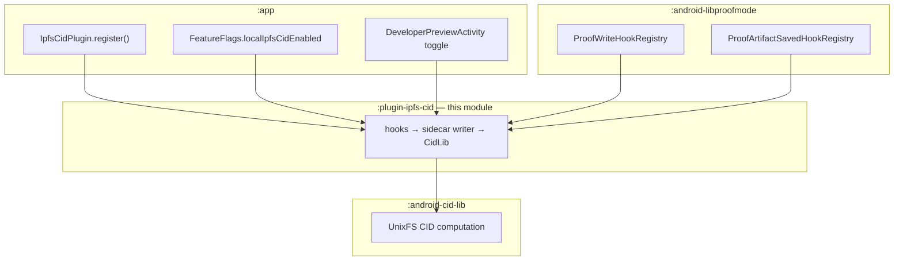
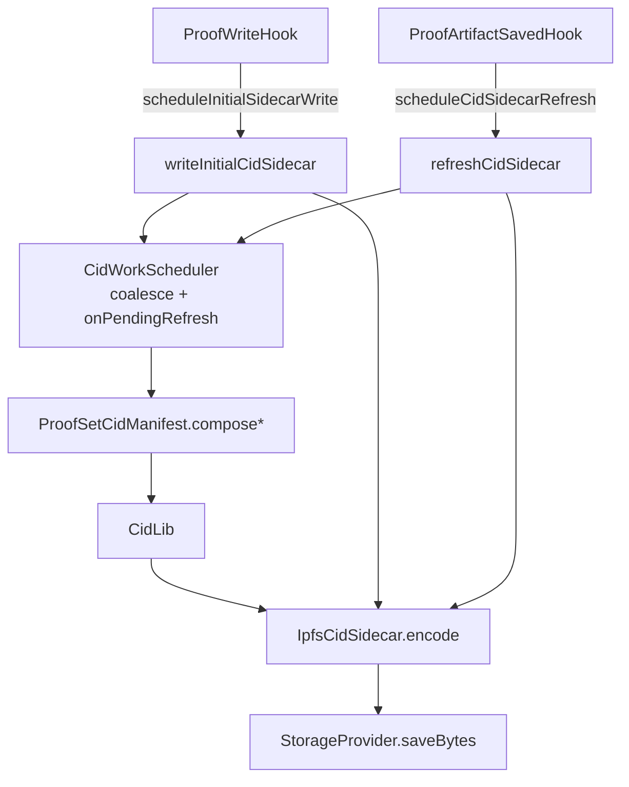

# plugin-ipfs-cid

Contributor-facing **policy and orchestration layer** for Proofmode's local-ipfs-cid feature. When the developer feature flag is on, this plugin registers lifecycle hooks after proof writes, applies membership policy, schedules CID work, and persists `{hash}.ipfs-cids.json` sidecars through `StorageProvider`. When the flag is off, registration is a no-op: no hooks, no native library load, no disk I/O.

CID math is delegated to [`:android-cid-lib`](../android-cid-lib/README.md). `:app` wires registration and the feature flag; it must not call `CidLib` directly.

Normative behavior (sidecar shape, membership rules, conformance requirements) is defined in the [local-ipfs-cid feature spec](../docs/spec/features/local-ipfs-cid/local-ipfs-cid_spec.md).

---

## Explanation

### Role in the stack



| Layer                      | Module                  | This module's boundary                     |
| -------------------------- | ----------------------- | ------------------------------------------ |
| Hooks only                 | `:android-libproofmode` | No CID types on libproofmode classpath     |
| **Policy + orchestration** | **`:plugin-ipfs-cid`**  | Gate, membership, scheduling, sidecar JSON |
| Computation                | `:android-cid-lib`      | `CidLib` only — no Context, no hooks       |

Dependencies: `implementation(project(":android-libproofmode"))`, `implementation(project(":android-cid-lib"))`.

### Feature flag and registration

| Item        | Value                                      |
| ----------- | ------------------------------------------ |
| Prefs file  | `feature_flags`                            |
| Key         | `pref_experimental_local_ipfs_cid_enabled` |
| Default     | `false`                                    |
| UI          | `DeveloperPreviewActivity` only            |
| App wrapper | `FeatureFlags.localIpfsCidEnabled`         |

`LocalIpfsCidGate.isEnabled(context)` reads the same key. Toggling the flag requires an **app restart** to attach or detach hooks (`FeatureFlags` logs this on set).

`IpfsCidPlugin.register(context)` is called from `ProofModeApp.onCreate`. When the gate is off it is a no-op: no hooks, no native load, no sidecar I/O (NF2).

For tests, an overload accepts injected `StorageProvider` and `gate`:

```kotlin
IpfsCidPlugin.register(context, storageProvider, gate)
```

### Internal flow

| Verb family         | Types                      | Responsibility                                              |
| ------------------- | -------------------------- | ----------------------------------------------------------- |
| **compose**         | `ProofSetCidManifest`      | Pure manifest builders — no Context, no I/O                 |
| **write / refresh** | `ProofSetCidSidecarWriter` | `writeInitialCidSidecar`, `refreshCidSidecar`               |
| **schedule**        | `CidWorkScheduler`         | Per-`proofSetHash` coalescing on a shared `sidecarExecutor` |



Both hooks use the plugin's single-threaded `sidecarExecutor`.

### Main types

| Class / object                | Purpose                                                        |
| ----------------------------- | -------------------------------------------------------------- |
| `IpfsCidPlugin`               | `ProofmodePlugin` entry; hook registration and test reset      |
| `LocalIpfsCidGate`            | Reads developer-preview flag from SharedPreferences            |
| `ProofSetCidSidecarWriter`    | Orchestrates initial write and late refresh                    |
| `CidWorkScheduler`            | Coalesces concurrent work per proof set; F12 pending follow-up |
| `ProofSetCidManifest`         | `composeByteBackedManifest` / `composeLeafBackedManifest`      |
| `ProofSetCidMembershipPolicy` | Include/deny/refresh rules for artifacts                       |
| `MediaLinkNaming`             | `{hash}.{ext}` injected media link names (F6a)                 |
| `IpfsCidSidecar`              | Sidecar JSON encode/decode (`{hash}.ipfs-cids.json`)           |
| `SidecarReader`               | Read/migrate sidecar snapshots for late recompute              |
| `CidSidecarWriteOutcome`      | Sealed outcomes + aligned Timber logging                       |

Glossary at the plugin boundary: `proofSetHash`, `artifactBasename`, `manifestLinkName`. Storage API types keep `hash` / `identifier` at the edge.

### Sidecar artifact

**Path:** `{proofSetHash}/{proofSetHash}.ipfs-cids.json` (via `StorageProvider`)

**Shape (v1):**

```json
{
  "version": 1,
  "rootCid": "bafy…",
  "files": { "{hash}.proof.csv": "bafk…", "{hash}.jpg": "bafk…" },
  "tsizes": { "{hash}.proof.csv": 123, "{hash}.jpg": 456 },
  "options": { "chunkSize": 262144, "cidVersion": 1, "rawLeaves": true },
  "computedAtMs": 1710000000000
}
```

Injected media uses extension-qualified keys (`{hash}.jpg`, not bare `{hash}`). Late notary artifacts (`.ots`, `.nostr`) appear in `files`/`tsizes` when prefs enable them and the files exist on disk.

### Membership policy (summary)

`ProofSetCidMembershipPolicy` decides what enters the directory root:

- **Core artifacts** — `.proof.csv`, `.proof.json`, `.asc`, etc. (see policy source)
- **Notary** — `{hash}.ots` / `{hash}.nostr` when respective prefs are on
- **Injected media** — bytes from `ProofWriteEvent.mediaUri`, not stored in hash dir
- **Denied** — sidecar itself, LP JSON artifacts, late debug snapshots

`triggersSidecarRefresh` gates which `ProofArtifactSavedHook` events schedule a recompute.

### Boundaries (do not break)

- **`:app`** — may call `IpfsCidPlugin.register` and `FeatureFlags`; must **not** import `CidLib`
- **`:android-libproofmode`** — hook registries only; zero `org.witness.proofmode.cid` imports in `src/main`
- **`:plugin-ipfs-cid`** — all CID policy and sidecar logic stays here
- **No network** — local computation only; no IPFS pinning or gateway fetch in v1

### Out of scope (v1)

IPFS upload integration, production UI for CIDs, runtime hook attach without restart, Maven publish of this module.

---

## How-to

### Enable the feature locally

1. Open **Developer Preview** (`DeveloperPreviewActivity`).
2. Turn on the **Local IPFS CID** switch (`pref_experimental_local_ipfs_cid_enabled`).
3. **Restart the app** — hooks attach only after restart; toggling at runtime does not hot-plug hooks.

`FeatureFlags.localIpfsCidEnabled` and `LocalIpfsCidGate.isEnabled(context)` read the same preference.

### Wire registration in `:app`

`ProofModeApp.onCreate` already calls:

```kotlin
IpfsCidPlugin.register(this)
```

Registration is always invoked; when the gate is off, the plugin returns immediately without registering hooks or loading native code. Do not call `CidLib` from `:app`.

### Run tests

Unit tests use Robolectric and borrow JNI libs from `:android-cid-lib` (test source set `jniLibs` in `build.gradle.kts`).

```bash
# Full plugin unit suite
./gradlew :plugin-ipfs-cid:testDebugUnitTest

# Key regression tests
./gradlew :plugin-ipfs-cid:testDebugUnitTest \
  --tests org.witness.proofmode.plugins.ipfscid.LocalIpfsCidZeroLeakageTest \
  --tests org.witness.proofmode.plugins.ipfscid.IpfsCidPluginLateNotaryE2ETest \
  --tests org.witness.proofmode.plugins.ipfscid.IpfsCidPluginRegisterTest

# libproofmode must not pull CID types onto classpath
./gradlew :android-libproofmode:testDebugUnitTest \
  --tests org.witness.proofmode.plugin.LibproofmodeNoCidClasspathTest

# Feature flag wiring
./gradlew :app:testDebugUnitTest \
  --tests org.witness.proofmode.FeatureFlagsLocalIpfsCidTest

# CID math conformance (computation layer)
./gradlew :android-cid-lib:testDebugUnitTest \
  --tests org.witness.proofmode.cid.IpfsCidConformanceTest
```

`FakeStorageProvider` lives in `src/test` for injection tests. Instrumented tests: `connectedDebugAndroidTest` when a device is available.

### Native build and verification

All Rust, NDK, UniFFI, hash-manifest, and `verifyRustCidLib` / `verifyUniffiBindings` steps live in **[android-cid-lib/README.md](../android-cid-lib/README.md)**. This module does not ship its own native build pipeline.

### When do I need to rebuild?

| Change                                      | Action                                                               |
| ------------------------------------------- | -------------------------------------------------------------------- |
| Rust crate, `.so`, or UniFFI glue           | Follow [android-cid-lib how-to](../android-cid-lib/README.md#how-to) |
| Plugin Kotlin only (policy, hooks, sidecar) | Run plugin tests above; no native rebuild                            |
| Feature flag or app wiring                  | Restart app; run `FeatureFlagsLocalIpfsCidTest`                      |

### Fork integrators

```kotlin
// settings.gradle — include ':android-libproofmode', ':android-cid-lib', ':plugin-ipfs-cid'

dependencies {
    implementation(project(":plugin-ipfs-cid"))  // pulls android-cid-lib + libproofmode transitively
}
```

Register `IpfsCidPlugin.register(context)` from your `Application.onCreate`. Gate behind your own dev flag or mirror `pref_experimental_local_ipfs_cid_enabled`.

---

## Further reading

- [local-ipfs-cid feature spec](../docs/spec/features/local-ipfs-cid/local-ipfs-cid_spec.md) — normative behavior
- [android-cid-lib README](../android-cid-lib/README.md) — computation API and native build pipeline
